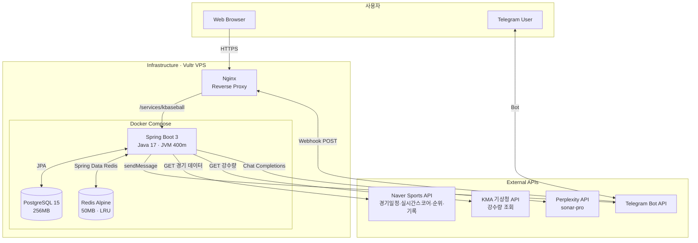
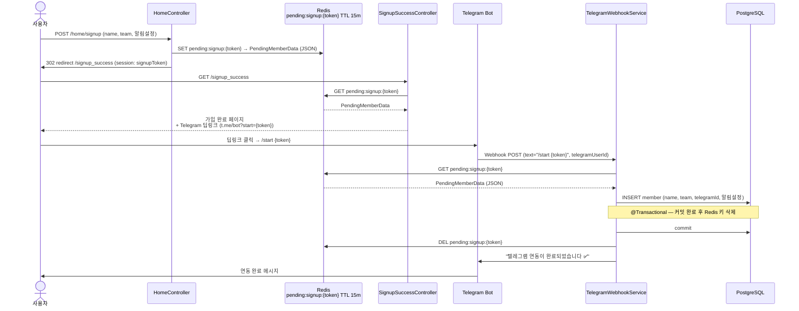
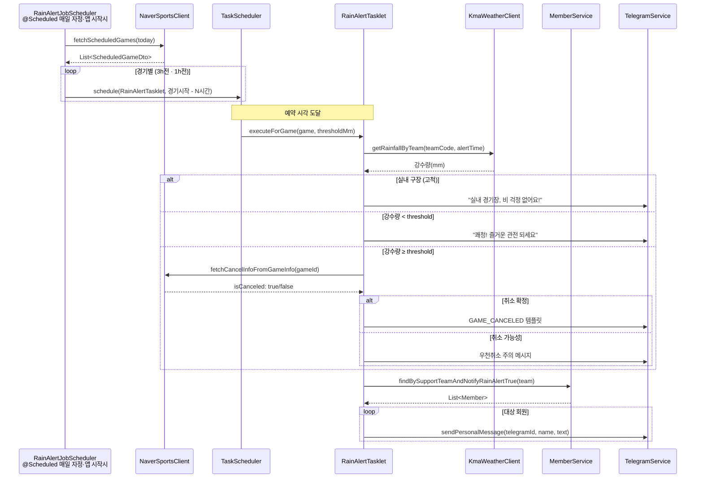
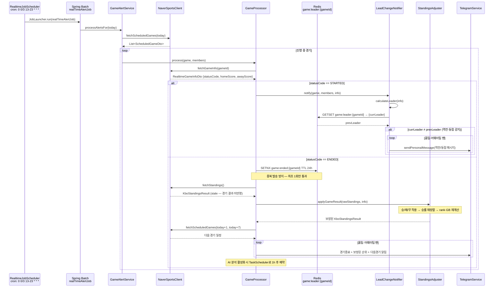
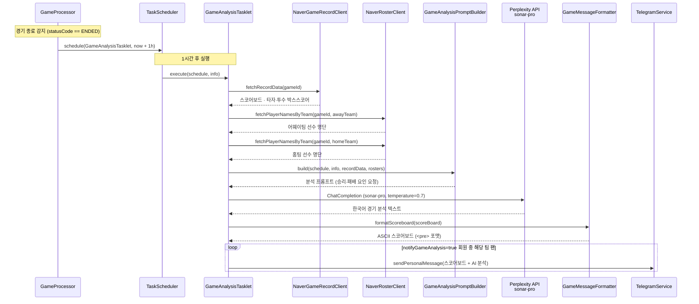
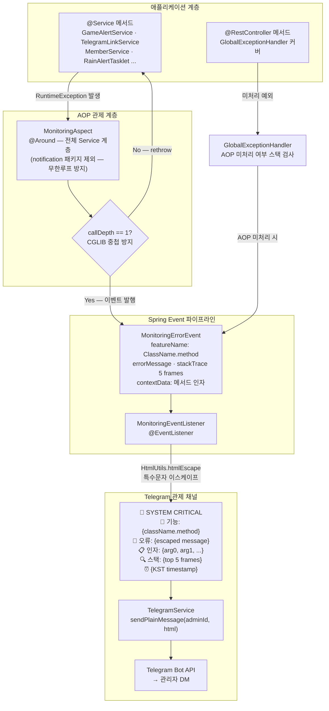
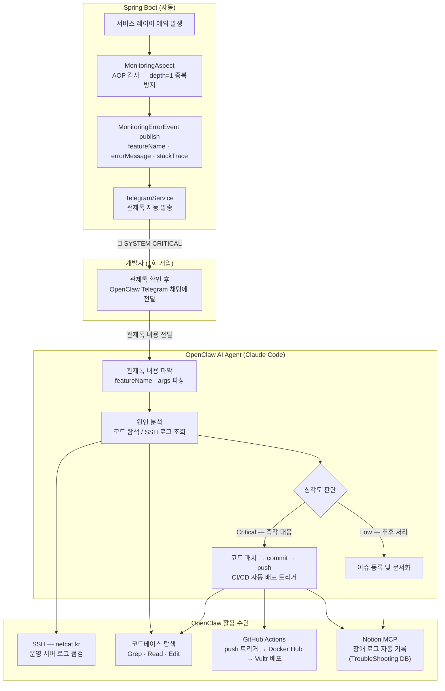

# Kbaseball


KBO 팬을 위한 실시간 경기 이벤트 알림 및 AI 분석 리포트 자동 발송 서비스.
텔레그램 봇을 통해 경기 중 핵심 이벤트(역전·동점·우천취소)를 즉시 수신하고, 경기 종료 후 GPT 기반 분석 리포트를 제공합니다.

---

## Features

| 기능 | 설명 |
|------|------|
| 우천 취소 감지 | 경기 3h/1h 전 기상청 API 연동, 취소 여부 즉시 공지 |
| 동점/역전 알림 | 3분 간격 스코어 폴링으로 리드 변경 이벤트 즉시 전송 |
| 경기 종료 알림 | 최종 스코어 + KBO 순위(경기 결과 즉시 보정) + 다음 경기 일정 포함 |
| AI 분석 리포트 | 경기 종료 1시간 후 Perplexity(sonar-pro) 기반 분석 자동 발송 |
| 장애 관제 | AOP + Spring Event 기반 서비스 계층 오류 실시간 알림 |
| Feature Toggle | 관리자 UI에서 기능별(AI분석/역전감지/우천알림) 런타임 토글 |

---

## System Architecture



---

## Data Flow

### 1. 회원가입 · Telegram 연동 (Lazy Registration)

DB에는 Telegram 연동이 확정된 회원만 저장됩니다. 폼 제출 시점에는 Redis에만 임시 데이터를 기록하고, 봇이 `/start` 명령을 수신하는 순간 `telegramId`를 포함한 레코드를 삽입합니다.



---

### 2. 우천 취소 알림



---

### 3. 동점 · 역전 실시간 알림



---

### 4. AI 경기 분석 리포트



---

### 5. 장애 관제 (AOP + Spring Event + Telegram)

서비스 계층 전체에 AOP를 적용해 예외를 가로채고, Spring Event 파이프라인을 통해 관리자 Telegram으로 실시간 관제 메시지를 발송합니다.
`@RestController` 계층 예외는 `GlobalExceptionHandler`가 별도로 커버하여 누락 없이 포착합니다.



#### 관제 메시지 포맷 예시

```
[🚨 SYSTEM CRITICAL]
📛 기능: GameAlertService.processAlertsFor
💬 오류: Read timed out executing GET https://api-gw.sports.naver.com/...
📋 인자: {arg0=2026-05-10}
🔍 스택:
  NaverSportsClient.fetchScheduledGames(NaverSportsClient.java:58)
  GameAlertService.processAlertsFor(GameAlertService.java:42)
  ...
⏰ 2026-05-10 18:03:21 KST
```

---

### 6. OpenClaw 기반 장애탐지 체계

**OpenClaw**는 이 프로젝트와 함께 운영되는 Claude Code AI 에이전트 워크스페이스입니다.
Spring AOP가 장애를 자동 감지해 Telegram으로 관제톡을 발송하면,
개발자가 해당 내용을 Telegram 연결 OpenClaw에게 전달하는 것만으로
코드 탐색·원인 분석·패치·커밋·Notion 기록까지 AI가 자율 수행합니다.



#### OpenClaw 워크스페이스 파일 구조

| 파일 | 역할 |
|------|------|
| `AGENTS.md` | 에이전트 세션 동작 규칙 — 메모리 관리, 그룹챗 예절, Heartbeat 활용법 |
| `SOUL.md` | 에이전트 핵심 가치관 및 행동 원칙 |
| `IDENTITY.md` | 에이전트 이름 · 캐릭터 · 시그니처 정의 |
| `USER.md` | 사용자 프로필 — 이름, 타임존, 선호 스타일 |
| `HEARTBEAT.md` | 주기적 점검 태스크 — 서버 상태, 이슈 배치 점검 |
| `TOOLS.md` | 로컬 환경 도구 메모 — SSH 호스트, 디바이스 정보 |

#### 활성 통합

| 통합 | 용도 |
|------|------|
| **Notion MCP** | 장애 로그·개발 기록 자동 작성 |
| **GitHub MCP** | 이슈·PR 조회 및 코멘트 |
| **OpenClaw Heartbeat** | 주기적 서버 관제·로그 점검 |

---

## Tech Stack

| Layer | Technology |
|-------|-----------|
| Runtime | Java 17, Spring Boot 3.x |
| Persistence | Spring Data JPA, PostgreSQL 15 |
| Batch | Spring Batch (Tasklet 기반) |
| Cache | Spring Data Redis |
| Scheduling | `@Scheduled` + `TaskScheduler` (ThreadPool size 4) |
| AOP | Spring AOP (`@Aspect`, `@Around`) |
| External API | RestTemplate + `@Retryable` (max 5, backoff 2s) |
| AI | Spring AI → Perplexity API (sonar-pro) |
| Notification | Telegram Bot API (Webhook 방식) |
| Infra | Docker Compose, Nginx, Vultr VPS, GitHub Actions CI/CD |

---

## Redis Key Strategy

| Key Pattern | TTL | Purpose |
|-------------|-----|---------|
| `pending:signup:{token}` | 15m | 임시 회원 데이터 (Lazy Registration) |
| `linked:signup:{token}` | 10m | Telegram 연동 완료 마커 (만료 페이지 오판 방지) |
| `game:leader:{gameId}` | 24h | 현재 리더 추적 (역전 감지용 이전값 비교) |
| `game:ended:{gameId}` | 24h | 경기 종료 처리 중복 방지 (SETNX) |

---

## Changelog

### v2 — Kbaseball · 2026-03-14 ~

- 도메인 분리 레이어드 아키텍처 (`com.kbank.kbaseball`)
- Redis 기반 상태 관리 (리더 추적, 중복 방지)
- Lazy Registration: 텔레그램 연동 완료 시점에만 DB INSERT
- AOP + Spring Event 기반 실시간 관제 시스템
- Feature Toggle (런타임 기능별 on/off)
- 경기 종료 알림 고도화 (실시간 순위 + 다음 경기 포함)
- StandingsAdjuster: 경기 종료 시 순위/승차 즉시 보정 (Naver API 지연 문제 해결)

### v1 — Baseball AI Agent · 2025-07 ~ 2026-03-13

- 단일 batch.service 구조 (`com.kbank.baa`)
- 인메모리 상태 관리

---

## Technical Docs

| 문서 | 내용 |
|------|------|
| [StandingsAdjuster](docs/standings-adjuster.md) | 경기 종료 순위 즉시 보정 로직 — 승차 공식, 재정렬 기준, 엣지 케이스 |
| [Lazy Registration & Bot Defense](docs/lazy-registration.md) | 봇 공격 대응 3층 방어 — Nginx rate limit, Honeypot, Redis TTL 기반 지연 DB 삽입 |
| [Redis State Design](docs/redis-state-design.md) | GETSET/SETNX 원자성 활용 — 역전 감지, 경기 종료 중복 방지, 서버 재시작 내성 |
| [Schema Evolution](docs/schema-evolution.md) | Flyway V1~V5 스키마 진화 — 복합 PK 실수 교정, soft delete, partial unique index 전환 |
| [Monitoring AOP Design](docs/monitoring-aop.md) | AOP 관제 설계 결정사항 — CGLIB callDepth 이중 발화 방지, notification 패키지 제외 이유 |

---

## Daily Work Logs

| 날짜 | 내용 요약 |
|------|----------|
| [2026-03-22](docs/daily-logs/2026-03-22.md) | v1 운영 전 점검, 회원탈퇴(soft delete + partial unique index), 관제 구조도 README 상세화, Thymeleaf section 밖 요소 버림 버그 2회 수정 |
| [2026-03-21](docs/daily-logs/2026-03-21.md) | Home/Preferences UI 모바일 최적화, Member 복합키→단일키 리팩터링, 텔레그램 연동 환영 메시지, signup_success UI 개편 |
| [2026-03-19](docs/daily-logs/2026-03-19.md) | StandingsAdjuster 도입 — 경기 종료 순위 즉시 보정, 승차 재계산, 단위·통합 테스트 81개 통과 |
| [2026-03-16](docs/daily-logs/2026-03-16.md) | HikariCP keepalive 설정, TaskScheduler 타임아웃 개선, TelegramWebhookRegistrar NPE 수정, OpenClaw 워크스페이스 초기화 |
| [2026-03-15](docs/daily-logs/2026-03-15.md) | v2 런칭: 관제 시스템, 경기종료 알림 고도화, Vultr 배포, Lazy Registration, 23개 커밋 |
| [2026-03-14](docs/daily-logs/2026-03-14.md) | Phase 1~6 대규모 리팩터링, CLAUDE.md 추가 |
